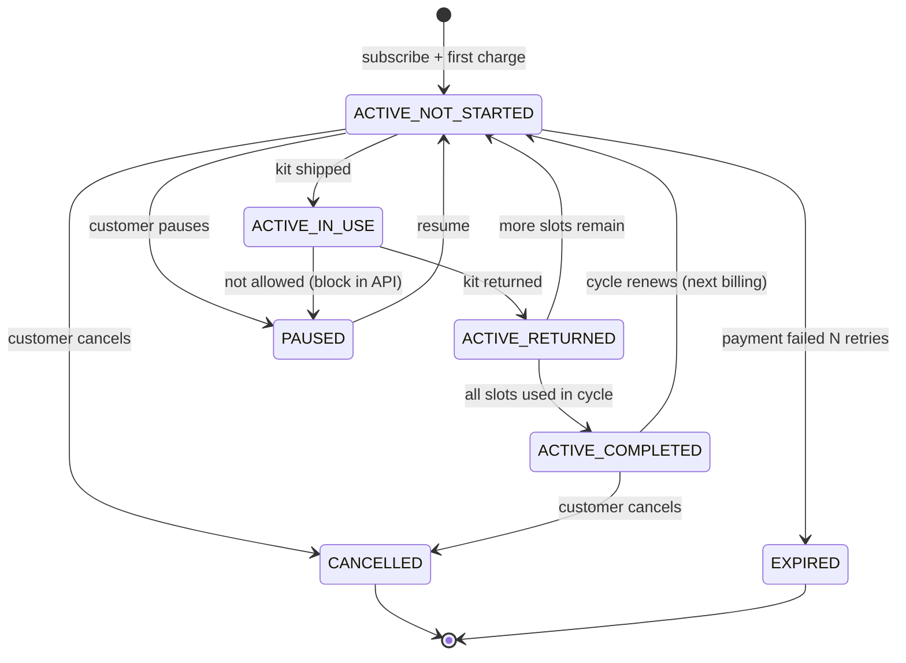
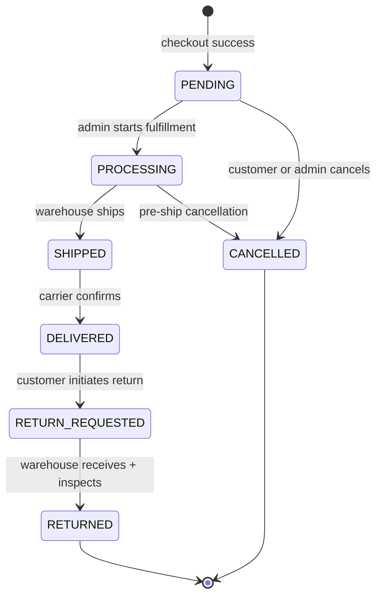
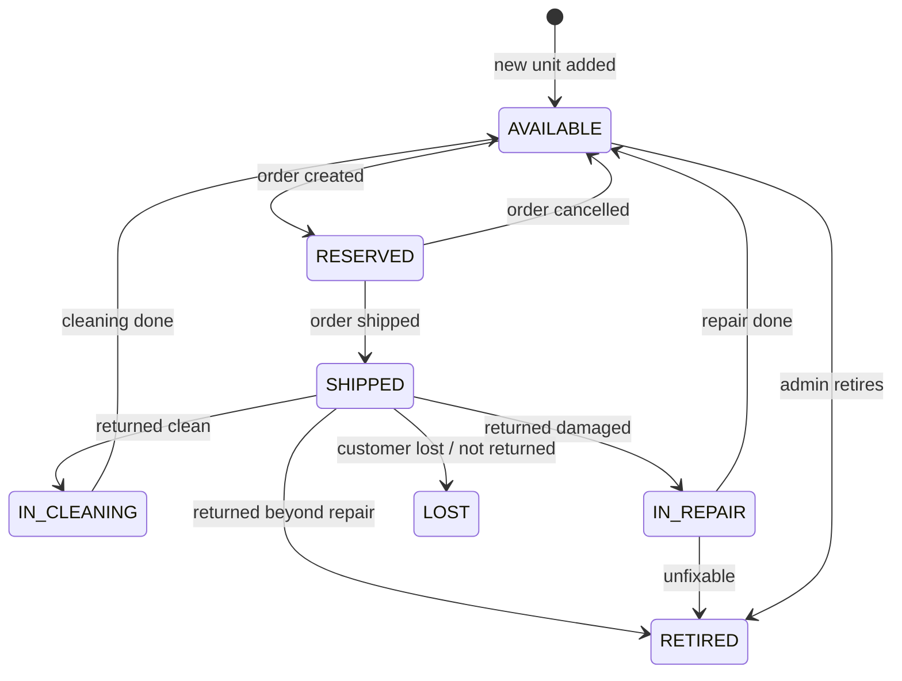

# CeleBrease — Production Flow

End-to-end reference for how the system operates in production: who does what, what state moves where, and which rules govern money, inventory, and shipping.

---

## 1. Product overview

CeleBrease is a **holiday-décor rental subscription**. A customer subscribes to a yearly plan that grants N holiday slots per year (Starter / Premium / Ultimate). For each slot they pick a **Kit** (curated décor bundle for one holiday), optionally add **Add-Ons**, choose a 30- or 60-day rental, pay a refundable **deposit**, and receive shipment. After the rental window they ship the kit back; admin **inspects** and decides full / partial / no refund of the deposit.

The system has two user surfaces:

- **`frontend/`** — public website + customer account (Next.js)
- **`admin/`** — back-office dashboard (Next.js)
- **`backend/`** — NestJS API + Prisma + Postgres + better-auth

---

## 2. Actors

| Actor        | Capability                                                                                                                |
| ------------ | ------------------------------------------------------------------------------------------------------------------------- |
| **Visitor**  | Browse landing, catalog, plans, FAQs, PDP — no auth                                                                       |
| **Customer** | All of the above + sign up, manage subscription, place orders, return kits, manage profile/addresses/payment, see history |
| **Admin**    | All inventory / kit / add-on / order / return / subscription / customer operations                                        |
| **System**   | Cron jobs: billing renewal, ship-by reminders, low-stock alerts, return-due alerts, deposit auto-refund on clean returns  |

---

## 3. Customer journey (end-to-end)

```
Discover ──► Subscribe ──► Pick Holiday Kit ──► Checkout ──► Receive ──► Use ──► Ship Back ──► Refund ──► Next Slot
```

### 3.1 Discover

1. Visitor lands on **Landing Page**, sees plans + featured kits.
2. Browses **Catalog** (filter by Traditional / Cultural / Event-Based).
3. Opens **PDP** for a kit → sees preview items, 30-day vs 60-day price, available date ranges, optional Add-Ons, reviews.
4. Reads **FAQs**, **How It Works**.

### 3.2 Subscribe

1. Visitor opens **Subscription Plans** page → sees Starter / Premium / Ultimate features.
2. Clicks **Subscribe** → must sign up (better-auth: email + password OR OAuth via `Account` table).
3. Provides payment method (`PaymentMethod` row) and billing address (`Address`).
4. System creates `Subscription` → `status = ACTIVE`, `stage = NOT_STARTED`, with `holidaysPerYear` slots prefilled as `SubscriptionHolidaySlot` rows in `PENDING` state.
5. First charge runs (monthly or yearly per `billingCycle`).

### 3.3 Pick a holiday kit

1. Customer goes to **Account Settings → Current Cycle**, sees Holiday 1 / 2 / 3 slots.
2. Picks an upcoming holiday (e.g., Christmas) → directed to **Catalog filtered by Holiday**.
3. Selects a Kit → PDP → picks rental duration + dates → adds Add-Ons → **Add to Cart**.
4. **Cart** holds `CartItem` (kit + holiday + duration + dates) and `CartItemAddOn[]`.

### 3.4 Checkout

1. Customer reviews cart totals: rental price + add-ons + delivery + tax + **deposit** (separate, refundable).
2. Picks delivery option (`STANDARD` or `EXPRESS`), shipping address, optional delivery note.
3. Confirms payment.
4. System creates `Order` (status `PENDING`, deposit `PENDING`), `OrderItem[]` snapshot of BOM, `OrderAddOn[]`, links it to the `SubscriptionHolidaySlot` (slot moves `PENDING → SELECTED`).
5. Charges card: `rentalPrice + addOnsTotal + deliveryFee + taxAmount + depositAmount`.
6. Inventory units transition `AVAILABLE → RESERVED` for that order.

### 3.5 Receive

1. Admin processes order → status `PENDING → PROCESSING → SHIPPED` (records `trackingNumber`, `shippedAt`).
2. `InventoryUnit.status = RESERVED → SHIPPED`.
3. `Subscription.stage = NOT_STARTED → IN_USE`, holiday slot status → `SHIPPED`.
4. On delivery confirmation: order → `DELIVERED`, `deliveredAt` set.
5. `expectedReturnAt = deliveredAt + duration`.

### 3.6 Ship back

1. Customer initiates return from Account Settings → order status moves to `RETURN_REQUESTED`.
2. System creates `Return` row (`returnNumber`, `dueDate = expectedReturnAt`).
3. Customer ships the kit using provided return label.

### 3.7 Inspect + refund

1. Box arrives at warehouse → admin scans, marks `Return.receivedAt`.
2. Admin opens **Return Inspection** screen, grades **condition** (`EXCELLENT` / `MINOR_SCUFFS` / `MAJOR_DAMAGE`), uploads damage photos, writes notes.
3. Logs `DamageEvent` rows for any damaged `InventoryItem` / `InventoryUnit` (with `loggedById = admin`).
4. Sets `refundDecision` (`FULL_REFUND` / `PARTIAL_REFUND` / `NO_REFUND`) and `refundAmount`.
5. System: refunds via payment provider, updates `Order.depositStatus → REFUNDED / PARTIALLY_REFUNDED / FORFEITED`.
6. `InventoryUnit` flow: damaged → `IN_REPAIR` or `RETIRED`; clean → `IN_CLEANING` → `AVAILABLE` after cleaning.
7. Order → `RETURNED`, holiday slot → `RETURNED`.
8. Subscription stage updates: if more slots available → back to `NOT_STARTED` for next slot; if all slots used → `COMPLETED` until next renewal.

### 3.8 Next slot

- Customer is prompted by email + in-app to pick the next holiday.
- Repeat from §3.3.

---

## 4. Subscription lifecycle (state diagram)



Two orthogonal axes on `Subscription`:

- `status` (`ACTIVE` / `PAUSED` / `CANCELLED` / `EXPIRED`) — billing/lifecycle
- `stage` (`NOT_STARTED` / `IN_USE` / `RETURNED` / `COMPLETED`) — current cycle progress

---

## 5. Order lifecycle (state diagram)



Side-effects per transition:

| From → To                      | Side effects                                                                                                                   |
| ------------------------------ | ------------------------------------------------------------------------------------------------------------------------------ |
| `PENDING → PROCESSING`         | Reserve `InventoryUnit`s for the order                                                                                         |
| `PROCESSING → SHIPPED`         | Units → `SHIPPED`, `Order.shippedAt` set, sub stage → `IN_USE`, slot → `SHIPPED`, send shipment email                          |
| `SHIPPED → DELIVERED`          | `Order.deliveredAt` set, schedule return reminder at `expectedReturnAt - 3d`                                                   |
| `DELIVERED → RETURN_REQUESTED` | Generate return label, create `Return` row                                                                                     |
| `RETURN_REQUESTED → RETURNED`  | `Return.receivedAt`/`inspectedAt` set, deposit refund computed, units → `IN_CLEANING`/`IN_REPAIR`/`RETIRED`, slot → `RETURNED` |
| `* → CANCELLED`                | Release reserved units back to `AVAILABLE`, void deposit hold, full refund of rental                                           |

---

## 6. Inventory unit lifecycle



Aggregate counts on `InventoryItem` (Available / Reserved / In Cleaning / In Repair / Retired / Shipped) shown on Inventory list are computed via `GROUP BY status` over `InventoryUnit`.

`DamageEvent` rows are inserted whenever a unit transitions out of `SHIPPED` into `IN_REPAIR` / `LOST` / `RETIRED` due to customer damage — this builds the **Damage History** log shown on Item Details.

---

## 7. Deposits + refunds

Deposit is **separate from rental price** and is held (not captured) at checkout where supported.

| Trigger                              | `Order.depositStatus`                                 |
| ------------------------------------ | ----------------------------------------------------- |
| Checkout success                     | `PENDING` (auth-only)                                 |
| Order ships                          | `HELD` (capture or hold-renewed)                      |
| Inspection: full refund              | `REFUNDED`, `depositRefund = depositAmount`           |
| Inspection: partial refund           | `PARTIALLY_REFUNDED`, `depositRefund < depositAmount` |
| Inspection: no refund (major damage) | `FORFEITED`, `depositRefund = 0`                      |
| Order cancelled before ship          | hold voided, no `Order` row deposit charge            |

Refunds go back to the original `PaymentMethod`. Audit trail: `Return.inspectedById` + `DamageEvent.loggedById` capture the admin who decided.

---

## 8. Admin operations

### 8.1 Daily dashboard (Admin Dashboard)

Top-line KPIs read live from DB:

- **Active Rentals** = `Order` count where `status IN (SHIPPED, DELIVERED, RETURN_REQUESTED)`
- **Deposits Held** = `SUM(depositAmount)` where `depositStatus = HELD`
- **Deposits Refunded (today)** = `SUM(depositRefund)` where `Return.inspectedAt::date = today`
- **Inspections Pending** = `Return` where `receivedAt NOT NULL AND inspectedAt IS NULL`
- **Returned Today** = `Order` where `returnedAt::date = today`
- **Subscription Revenue** = monthly recurring from `Subscription.plan.monthlyPrice`
- **Holiday Distribution** = `GROUP BY holidayId` of active orders

### 8.2 Inventory ops

- **Add Item** (3-step wizard): basic info → kit mapping (assign to which kits, qty per kit) → review → save.
- Per-item actions: **Mark as Cleaned**, **Move to Repair**, **Mark Lost**, **Add Replacement Unit**, **Retire Item**, **Edit**.
- **Low-stock alert**: cron checks `qtyAvailable < lowStockThreshold` daily, posts to admin notification feed and locks dependent kits to `LOW_STOCK` status.

### 8.3 Kit ops

- **Create Kit Tier** form: tier (Starter/Premium/Ultimate), holiday, category, 30-day price, 60-day price (optional), deposit, season window, BOM (Bill of Materials).
- **Admin toggles** per kit: `visibleOnPdp`, `addOnsEnabled`, `limitInventory` (caps concurrent rentals).
- **Validation rules**: deposit must match plan-tier convention (e.g., Premium = $100), all BOM items must have `qtyAvailable >= kitItem.qty * concurrentRentals`.
- **Save Draft** vs **Save Changes** vs **Preview PDP** — `Kit.status = DRAFT` is invisible to customers.

### 8.4 Add-On ops

- Create / edit / hide / delete.
- Map to one or more holidays (`AddOnHoliday`) and to specific kits (`KitAddOn`).
- Inventory counter independent of `InventoryItem` (add-ons are simpler stockables).

### 8.5 Order ops

- Filter by Kit / Holiday / Status. Right-side panel shows full order details.
- Manual transitions: `PROCESSING → SHIPPED` (enter tracking), force-cancel.
- Resend shipment email, generate return label early.

### 8.6 Return inspection

- Queue: `Return.receivedAt NOT NULL AND inspectedAt IS NULL`.
- Workflow on **Return Inspection** screen:
    1. Pick **Damage** grade (Excellent / Minor Scuffs / Major Damage).
    2. Upload damage photos (`ReturnDamageImage`).
    3. Write damage notes.
    4. Pick **Refund Decision** (Full / Partial / No).
    5. For each damaged BOM item: log a `DamageEvent` with type (`BROKEN`, `MISSING_PART`, `LOST_BY_CUSTOMER`, `DAMAGED_BY_CUSTOMER`).
    6. Submit → triggers refund + unit-status transitions atomically.

### 8.7 Subscription ops

- Filter by Plan / Stage / Status.
- View customer's holiday slots, billing, payment method.
- Manual stage / status overrides (rare; e.g., comp a holiday).

### 8.8 Customer ops

- 360 view: orders, returns, subscription, region, **on-time-return rate** (`returnedAt <= expectedReturnAt`).
- Used for risk-grading deposit decisions or fraud review.

---

## 9. Cross-cutting rules

- **Seasonal availability** — a Kit is only orderable when `seasonStart <= today <= seasonEnd` OR `alwaysVisible = true`.
- **Concurrent inventory caps** — if `Kit.limitInventory = true`, prevent new orders when `inventoryLimit` reached for overlapping rental windows.
- **Holiday slot exclusivity** — one slot may not be re-used in the same cycle; cancellation releases the slot back to `PENDING`.
- **Deposit cannot exceed plan rules** — admin save validates against business config.
- **Auth boundary** — `User.role = "admin"` gates all `/admin` API routes; better-auth session required for all customer endpoints except public catalog/PDP.
- **Audit trail** — every `Return` and `DamageEvent` records the admin user (`inspectedById`, `loggedById`).
- **Soft-hides** — items / kits / add-ons use `status` flags, never hard-delete (history depends on FKs).

---

## 10. Notifications + system jobs

| Event                  | Channel      | Trigger                                               |
| ---------------------- | ------------ | ----------------------------------------------------- |
| Welcome                | Email        | New `User` created                                    |
| Subscription confirmed | Email        | `Subscription.startedAt`                              |
| Order placed           | Email + SMS  | `Order` created                                       |
| Order shipped          | Email + SMS  | `Order.shippedAt` set                                 |
| Return reminder        | Email        | Cron: 3 days before `expectedReturnAt`                |
| Return overdue         | Email        | Cron: `expectedReturnAt < now AND status != RETURNED` |
| Refund issued          | Email        | `Return.inspectedAt` + refund computed                |
| Pick next holiday      | Email        | Slot status → `RETURNED` and unused slots remain      |
| Renewal upcoming       | Email        | Cron: 7 days before `nextBillingAt`                   |
| Renewal charged        | Email        | `Subscription.nextBillingAt` reached                  |
| Low stock              | Admin in-app | Cron: `qtyAvailable < lowStockThreshold`              |
| Inspection pending     | Admin in-app | `Return.receivedAt` set                               |

Suggested queue: BullMQ on Redis driven by NestJS `@nestjs/schedule` + a `JobsModule`.

---

## 11. Tech architecture

```
┌────────────────┐     ┌────────────────┐
│  frontend/     │     │   admin/       │
│  Next.js       │     │   Next.js      │
│  customer site │     │   admin panel  │
└───────┬────────┘     └────────┬───────┘
        │   HTTPS / better-auth │
        ▼                       ▼
        ┌──────────────────────────┐
        │   backend/  NestJS       │
        │   ─ better-auth          │
        │   ─ Prisma 7             │
        │   ─ Postgres             │
        │   ─ BullMQ (jobs)        │
        │   ─ Stripe (payments)    │
        │   ─ S3 (image storage)   │
        │   ─ Resend (email)       │
        └──────────────────────────┘
```

- **Auth**: better-auth issues `Session` cookies; `User.role` differentiates customer vs admin.
- **DB**: Postgres via `@prisma/adapter-pg`. Schema lives at [backend/prisma/schema.prisma](backend/prisma/schema.prisma).
- **Money**: Stripe — `PaymentMethod.providerRef` stores tokenized PMs; deposits use `manual_capture` to support partial refunds at inspection time.
- **Storage**: S3 (or compatible) for `InventoryItemImage`, `KitImage`, `AddOnImage`, `ReturnDamageImage`.
- **Cron**: NestJS `@Cron(...)` decorators inside `JobsModule` enqueue work into BullMQ.

---

## 12. Build sequence (suggested)

1. Run `pnpm exec prisma migrate dev --name init_celebrease`.
2. Seed `Holiday` taxonomy + `Plan` rows.
3. Wire backend modules in dependency order: `auth → users → addresses → vendors → holidays → inventory → kits → addons → plans → subscriptions → cart → orders → returns → admin/jobs`.
4. Build admin panel pages in dependency order: Dashboard → Inventory → Kits & Pricing → Add-Ons → Subscriptions → Orders → Returns → Customers.
5. Build customer site: Landing → Catalog → PDP → Plans → Auth → Cart → Checkout → Account Settings → FAQs.
6. Integrate Stripe (deposit hold + capture/refund flow first — it gates returns).
7. Wire jobs (renewal billing, return reminders, low-stock alerts).
8. End-to-end smoke: subscribe → order → ship → return → refund.
